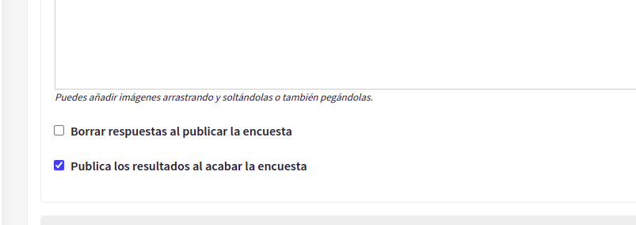
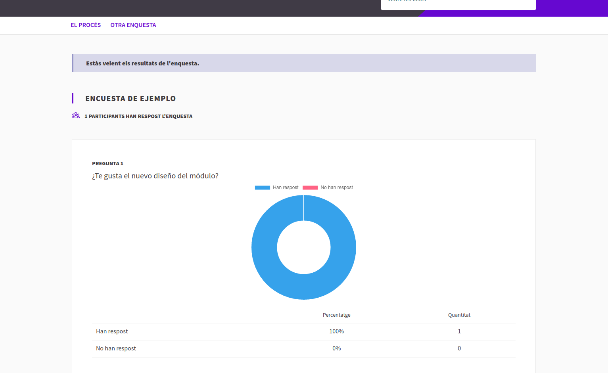

# Decidim::SurveyResults

This module enables the admins to show survey results to participants through a new survey results page.
WARNING: This module is in Beta, use it at your own risk.

## Usage

This feature is only available for the survey component. It can be activated from the component configuration with the check "Publish results at survey end".



If checked, when the survey ends, participants and users will be shown a link to the results page with one chart for each question.



## Installation

Add this line to your application's Gemfile:

```ruby
gem "decidim-survey_results"
```

And then execute:

```bash
bundle
```

## Contributing

See [Decidim](https://github.com/decidim/decidim).

## License

This engine is distributed under the GNU AFFERO GENERAL PUBLIC LICENSE.
